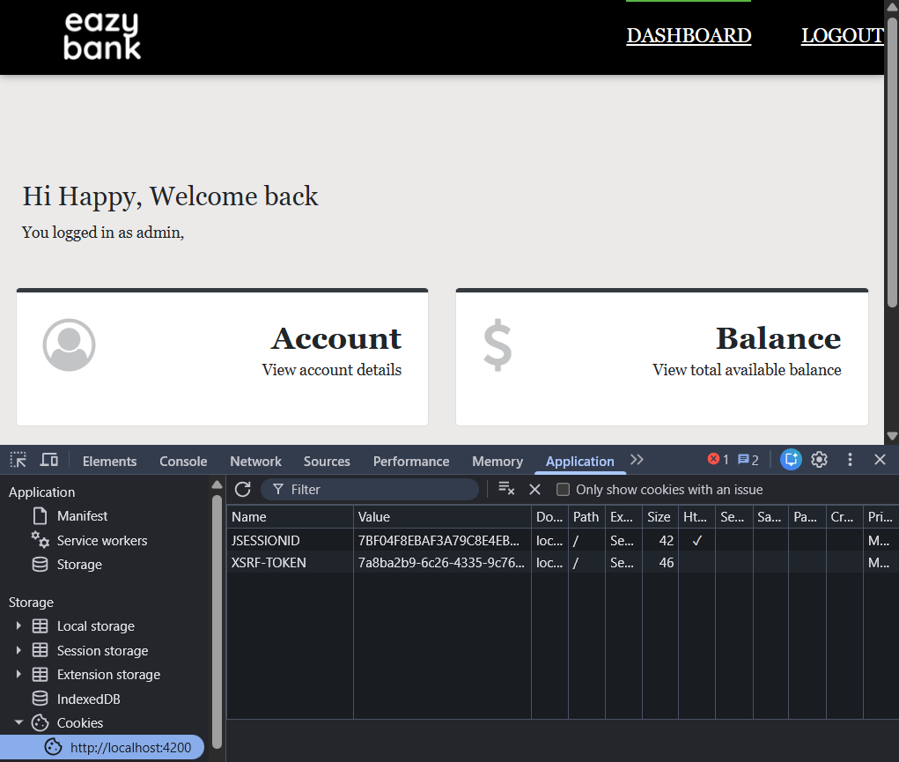
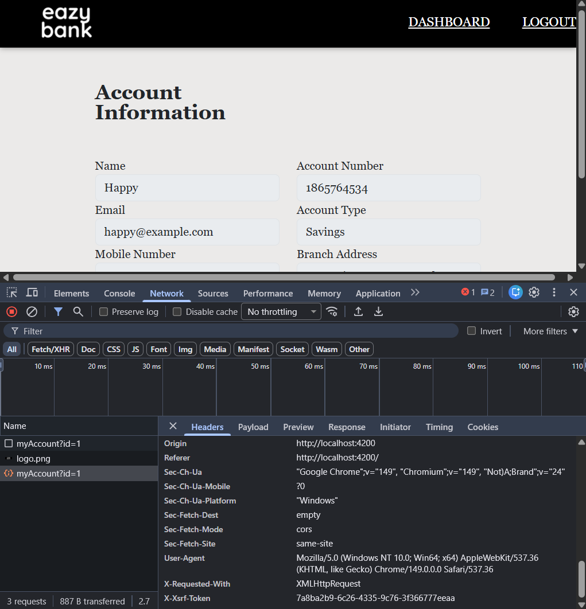

## CORS and CSRF

CORS and CSRF are common attacks that can happen when a browser interacts with our backend APIs.

### 1. Cross-origin resource sharing (CORS)

CORS is a protocol that enable scripts running on a browser client to **interact with resources from a different origin**.
For example, a UI app making an API call running on a different domain would be blocked by default due to CORS. It is a specification from W3C implemented by most browser. 
This is to prevent communication between different origins, which is common when hackers try to attack applications.

When browsers detect that the traffic is going to another origin, it will make a _preflight request_ to the backend server before the actual API request.
As part of this preflight request, the browser will check for CORS configurations from the backend server to allow/prevent cross-origin communication.
Browsers will not prevent communication originating from the same server.

"Other origins" means the URL being accessed differs from the location that the JavaScript is running from, such as:
* a different scheme (HTTP or HTTPS)
* a different domain
* a different port

**Solutions to handle CORS:**

* To allow communication between different origins for a REST service deployed in Spring Boot, we can add the **@CrossOrigin** annotation,
which allows clients from any domain to consume the API. We can specify the domain to be accepted with **(origins = "domain-name")**.

* Alternatively, instead of annotating every controller, we can define CORS related configuration in our **SecurityFilterChain** by specifying the configurations in **http.cors** customiser.

### 2. Cross-site request forgery (CSRF)

CSRF attacks aim to perform an operation in a web application **on behalf of a user without their explicit consent**.
In general, it doesn't steal the user's identity, but it exploits the user to carry out an action without their will.

For example, a user logs in to a website and the backend server provides a cookie that is stored in the browser against the website's domain name.
The user navigates to a malicious website in the same browser with the stored cookie.
The malicious website could contain a form action that _makes a request to the original website_ without the user knowing.
Since the cookie was already present in the browser, the backend server of that website cannot differentiate where the request came from.

> Even with CORS implemented, CSRF attacks are possible. When embedded forms are used to make a request, the server would interpret it as originating from the domain specified in the form action.

When we do not customise our CSRF implementation, Spring Security will by default prevent HTTP methods that create, alter, or delete data (POST, PUT, DELETE).

**Solutions to handle CSRF:**
* The application needs a way to determine if the HTTP request is legitimately generated via the application UI. This can be done through a **CSRF token** - a secure random token that needs to be unique per user session, attached as a cookie.
The CSRF token value can be generated during the login operation or first GET request. 
* This token has to be sent as part of the request (in the header or payload), as well as the cookie.
The attacker would not be able to send it as part of the request header or body since the executed JavaScript code used to populate the CSRF token from the cookie can only read cookies from the same domain. 
* In the **CookieCsrfTokenRepository** class (an implementation of the **CsrfTokenRepository** interface), there are methods such as **generateToken()**, **loadToken()**, and more, that generates the CSRF token during login and send it to the UI application. 
Subsequent requests can validate the token using the **CsrfFilter**.
* In the CsrfFilter, we must specify where to read the CSRF token from the request and extract it. The **CsrfTokenRequestAttributeHandler** object needs to be created to be set under the Csrf configurations.

We then specify in the client-side to receive the CSRF token from the cookies and send it as part of the request header in every subsequence request:

