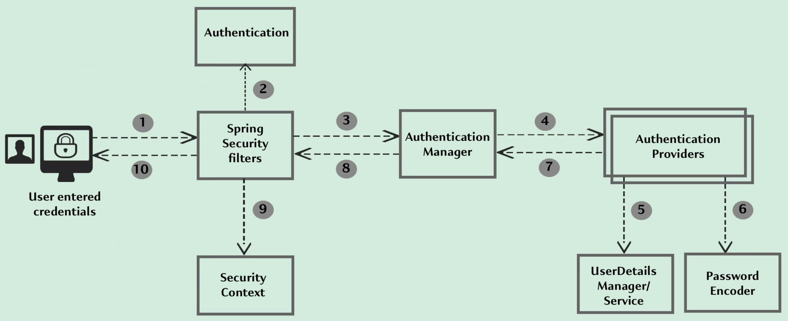

## 1. Spring Security

By default, Spring Security will protect every API and MVC path available inside our project.
It contains a series of filters that intercepts every request and redirects a user that do not have the appropriate credentials to access the resource.

### Spring Security internal flow:

* **Filters** intercept every request that a client sends to the API. Depending on our configuration, these filters can handle different exceptions and return a 4xx error.
* Spring Security converts the credentials from the HTTP request into an authentication object that is to be used by other components.
* The filter will forward the request to the authentication manager, which will convey the results of the authentication.
* The actual authentication is conducted by authentication providers.
* Regardless of whether the authentication is successful or not, the authentication object is stored in the **security context**.
* This authentication object is stored against a session id that is created for a given browser.
* Once the first request is processed and there ia an entry in the security context, subsequent requests will make use of this entry.

### Default implementation of authentication in Spring Security:

When our credentials are successfully validated, a JSESSIONID is generated and stored in our browser cookies. Spring Security maps this session id to the authentication details. 
These details will be used every time we try to access a protected API - thus not needing to invoke an authentication check for every single request.

