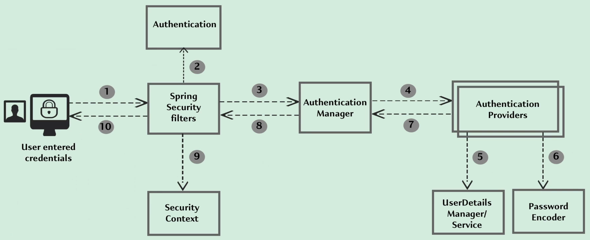
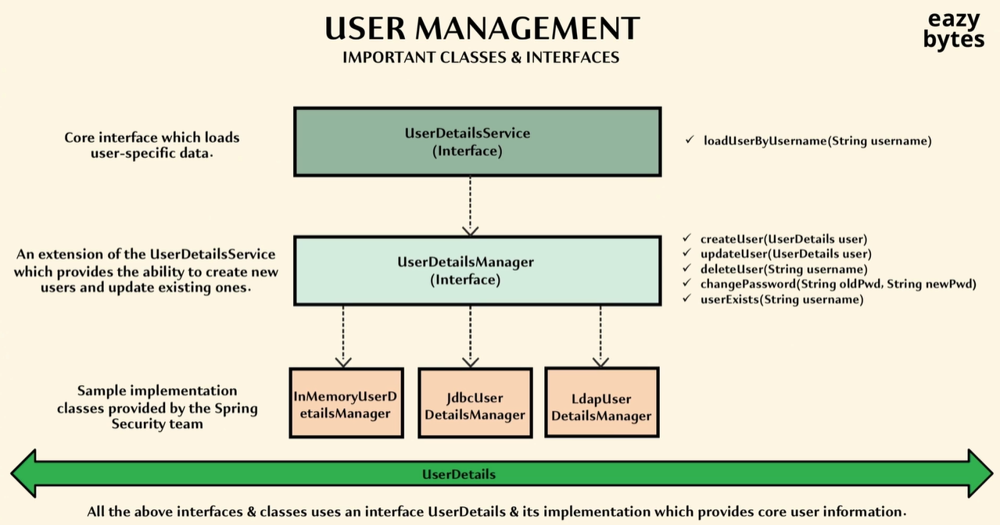
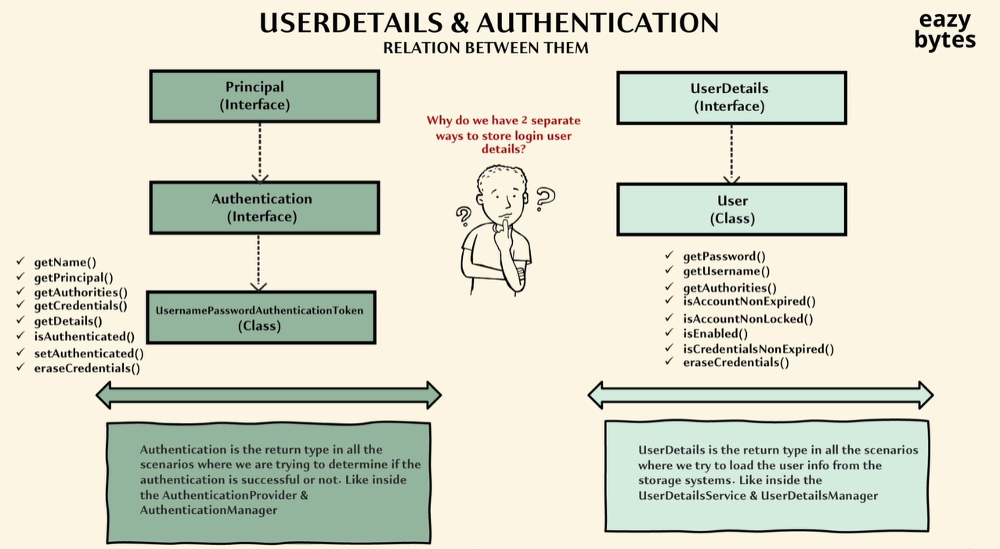

## Spring Security

By default, Spring Security will protect every API and MVC path available inside our project.
It contains a series of filters that intercepts every request and redirects a user that do not have the appropriate credentials to access the resource.

### Spring Security internal flow:

* **Filters** intercept every request that a client sends to the API. Depending on our configuration, these filters can handle different exceptions and return a 4xx error.
* Spring Security converts the credentials from the HTTP request into an authentication object that is to be used by other components.
* The filter will forward the request to the authentication manager, which will convey the results of the authentication.
* The actual authentication is conducted by authentication providers.
* Regardless of whether the authentication is successful or not, the authentication object is stored in the **security context**.
* This authentication object is stored against a session id that is created for a given browser.
* Once the first request is processed and there is an entry in the security context, subsequent requests will make use of this entry.

### Default implementation of authentication in Spring Security:

When our credentials are successfully validated, a JSESSIONID is generated and stored in our browser cookies. Spring Security maps this session id to the authentication details. 
These details will be used every time we try to access a protected API - thus not needing to invoke an authentication check for every single request.

Spring Security implements a default **Security Filter Chain** to handle every request.
The security filter chain object is registered as a Bean. To customise the behaviour of the filter chain, we need to create our own SecurityFilterChain bean. 

#### SecurityFilterChain syntax:
* requests . requestMatchers() - accepts any number of API paths we can pass as input
* requests . requestMatches() . authenticated() - allows authenticated users to access the specified API paths
* requests . requestMatches() . permitAll() - the API path can be accessed without security
* requests . requestMatches() . denyAll() - all requests to the API will be denied regardless of whether the user is authenticated or not

#### Basic authorisation:
Credentials are sent in the request header with the name **Authorisation**, containing prefix _Basic_ and the encoded credentials.
These credentials are base64 encoded in the format username:password.

### User management in Spring Security:

Spring Security provides three sample implementations of the **UserDetailsManager interface**. We can define our custom implementation by implementing this interface.
The user management interfaces and their methods leverage on the **UserDetails interface** (a representation of an end user).
The sample implementation of the UserDetails interface is the User class.

### UserDetails interface vs Authentication interface:

Some of the helper methods required from the UserDetails interface (e.g. checking credential expiry, checking account expiry) is only needed once the authentication is completed.
In situations where authentication is unsuccessful, there is no meaning in using such helper methods. Separated interfaces were created to avoid unnecessary carry-over of such methods.

### Custom implementation to fetch credentials:

We can instruct Spring Security to fetch user credentials from our own custom table instead of the default implementation by implementing and overriding methods (e.g. loadUserByUsername) from the UserDetailsService.
The authentication provider will use our custom Bean that will query our own table.
